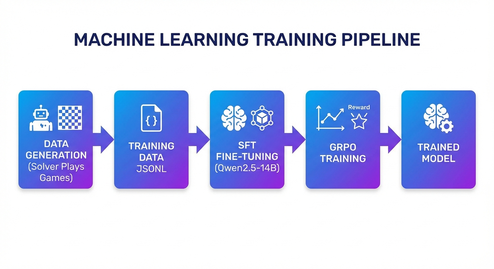
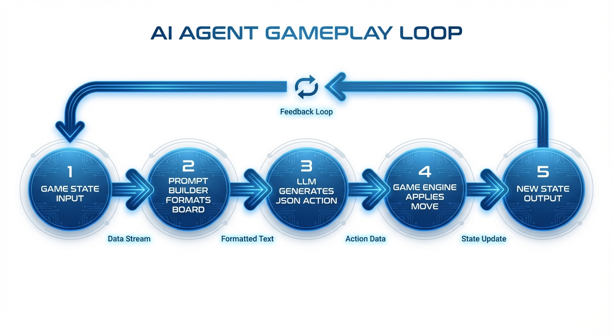
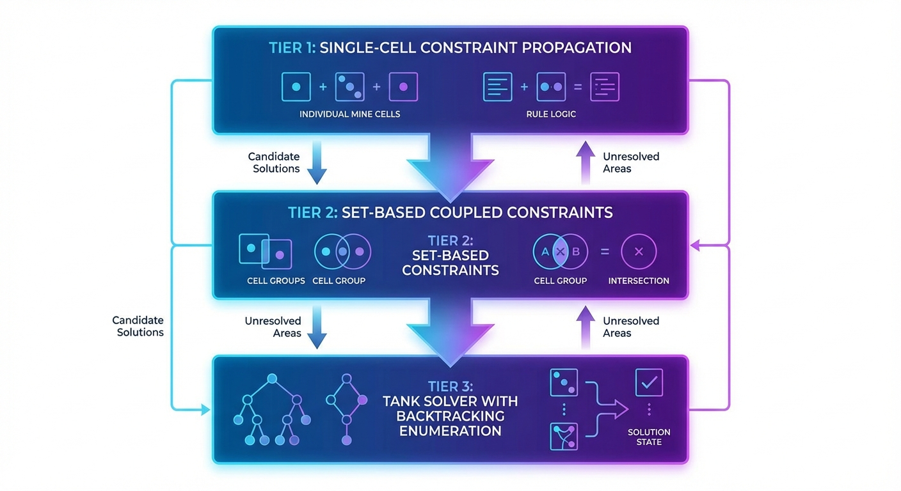
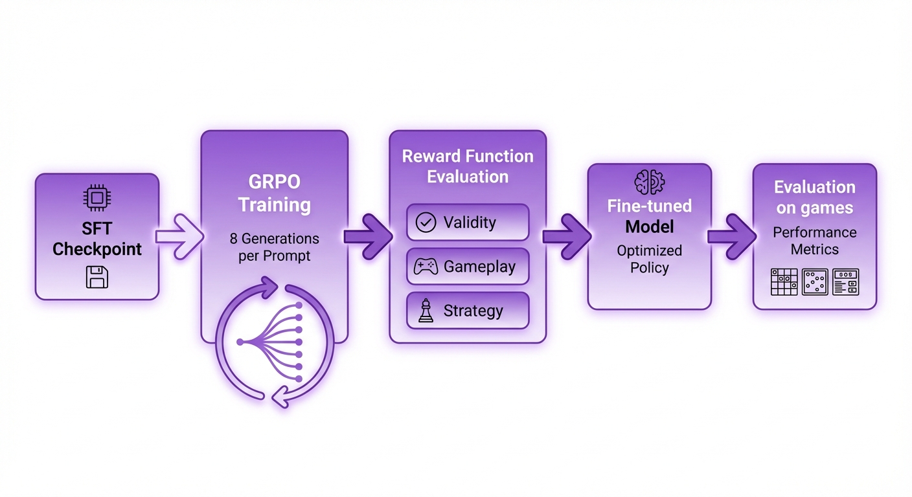

# IITD Feb26 RL Minesweeper

A Reinforcement Learning project for training LLMs to play Minesweeper using GRPO (Group Relative Policy Optimization).

## Overview

This project trains language models to play Minesweeper through a novel approach combining:

- **3-Tier Constraint Satisfaction Solver** - Generates optimal move labels and computes cell probabilities
- **GRPO Training** - Reinforcement learning from LLM-generated game trajectories
- **Size-Adaptive Prompting** - Compact grid format for small boards, frontier sparse format for large boards
- **Multi-Stage Training Pipeline** - SFT → GRPO → Continued Training



## Project Structure

```
├── agents/
│   ├── minesweeper_agent.py   # Size-adaptive prompt builder
│   ├── minesweeper_model.py    # LLM wrapper for minesweeper gameplay
│   └── agent_server.py         # Agent server for deployment
├── solver.py                   # 3-tier constraint satisfaction solver
├── generate_data.py            # Training data generator
├── run_grpo.py                # GRPO training script
├── run_grpo_frontier.py       # GRPO with frontier constraint evaluation
├── train_*.py                 # SFT training scripts (continued/sft variants)
├── eval_*.py                  # Evaluation scripts
├── minesweeper_train.py        # Main training notebook
├── minesweeper_grpo.ipynb     # GRPO training notebook
├── prompt_battle.py           # Compare different prompting strategies
├── merge_model.py             # Merge LoRA adapter into base model
├── test_e2e.py               # End-to-end testing
├── ruff.toml                  # Linter configuration
└── CLAUDE.md / STRATEGY.md   # Development notes
```

## Quick Start

### Prerequisites

```bash
pip install unsloth trl transformers torch datasets
```

### Training Pipeline

1. **Generate Training Data**
```bash
python generate_data.py --rows 16 --cols 16 --num-games 10000 --output data/
```

2. **Supervised Fine-Tuning (SFT)**
```bash
python train_sft_v2.py --model Qwen/Qwen2.5-14B-Instruct --data data/
```

3. **GRPO Training**
```bash
python run_grpo.py --sft-checkpoint sft_checkpoint/ --output grpo_checkpoint/
```

4. **Evaluate**
```bash
python eval_final.py --model grpo_checkpoint/ --num-games 100
```

### Running the Agent

```bash
python agents/minesweeper_agent.py --game-state state.json --config config.yaml
```



## The Solver

A 3-tier constraint satisfaction solver used for ground-truth labels and reward computation:



**Tier 1**: Single-cell constraint propagation
- Deduce mines/safes from immediate neighbors

**Tier 2**: Set-based coupled constraints
- Subset reduction for coupled cells

**Tier 3**: Tank solver (backtracking enumeration)
- Component partitioning for complex scenarios

## Key Features

### Size-Adaptive Prompting

The agent uses different prompt formats based on board size:

| Board Size | Format | Description |
|------------|--------|-------------|
| ≤16×16 | Compact | Inline grid representation |
| >16×16 | Frontier | Sparse constraint-based representation |

### GRPO Reward Design

Rewards are computed based on:
- **Validity**: Move is within bounds (large penalty)
- **Already Revealed**: Move on revealed cell (large penalty)
- **Already Flagged**: Move on flagged cell (medium penalty)
- **Deducibility**: Move follows solver logic (positive reward)
- **Win Condition**: Successful mine avoidance (large reward)

### Constraint Evaluation (Frontier)

When `use_frontier=True`, the model is scored on:
- Whether a move is deducible from constraints
- Comparison against optimal solver moves



## Configuration

Edit `minesweeper_config.yaml` for runtime settings:

```yaml
model:
  name: Qwen/Qwen2.5-14B-Instruct
  max_tokens: 512
  temperature: 0.7

training:
  learning_rate: 1e-6
  batch_size: 32
  max_seq_length: 8192
```

## Results

See `oneepager.pdf` and `whitepaper.pdf` for detailed experimental results on:
- Training curves
- Win rates across difficulty levels
- Comparison with baseline approaches

## Development

### Code Quality

```bash
# Check linting
ruff check .

# Auto-fix issues
ruff check --fix .

# Format code
ruff format .
```

### Testing

```bash
# End-to-end test
python test_e2e.py

# Evaluate prompting strategies
python prompt_battle.py
```

## License

MIT License

## Acknowledgments

- IIT Delhi for the competition framework
- Unsloth for efficient fine-tuning
- Qwen team for the base model
